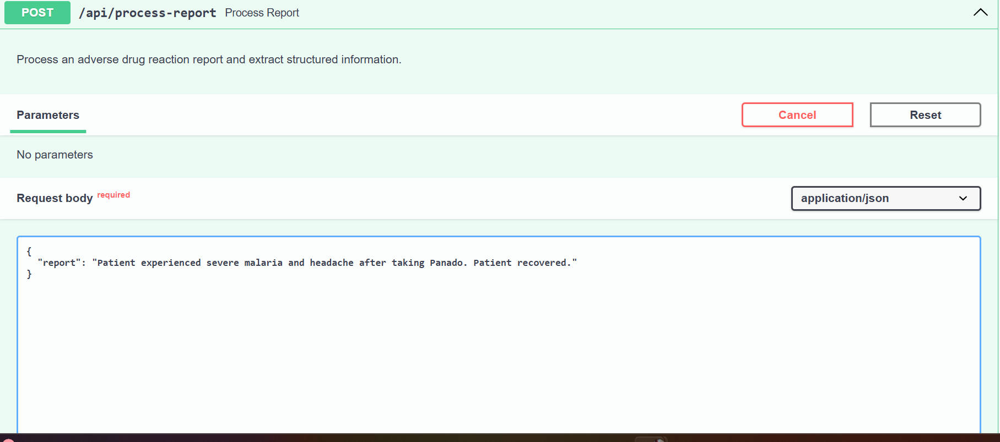
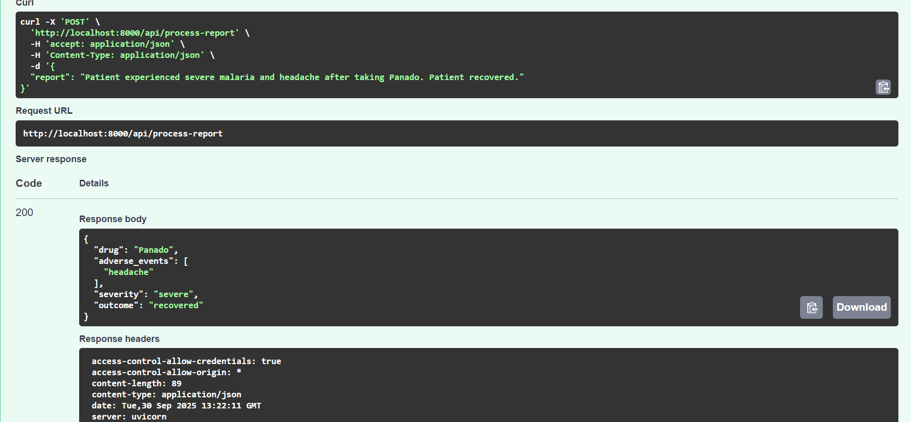
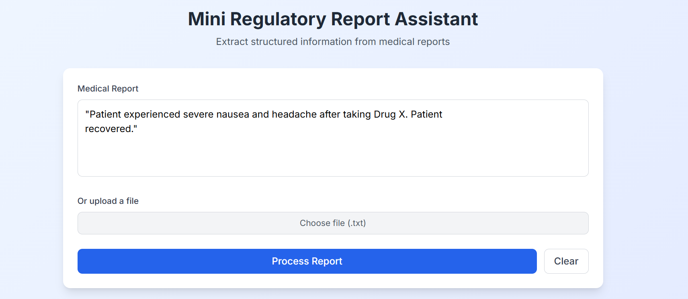
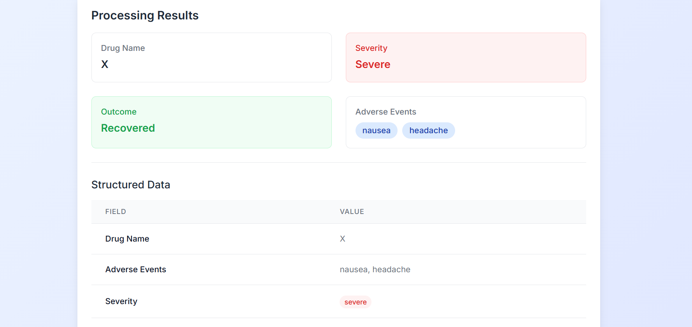

# Mini Regulatory Report Assistant

A full-stack application that extracts structured information from  medical reports using NLP and rule-based processing.

##Features

- Text Input: Paste or type medical reports directly
- File Upload: Support for `.txt` files (PDF and Word support can be added)
- Real-time Processing: Instant extraction of structured data
- Visual Results: Clean card and table display of extracted information
- Responsive Design: Works on desktop and mobile devices

##Extracted Information

The system extracts the following structured fields from medical reports:

- Drug Name: The medication mentioned in the report
- Adverse Events: List of side effects (nausea, headache, rash, etc.)
- Severity: Classification as mild, moderate, or severe
- Outcome: Patient status (recovered, ongoing, or fatal)

##Technology Stack

###Backend
FastAPI: High-performance Python web framework
NLTK: Natural Language Toolkit for text preprocessing
Rule-based NLP: Custom logic for medical text extraction

### Frontend
Next.js: React framework with App Router
TypeScript: Type-safe JavaScript
Tailwind CSS: Utility-first CSS framework
Modular Architecture: Clean component structure

##Installation

###Prerequisites
Python 3.8+
Node.js 16+
pip (Python package manager)
npm (Node.js package manager)

###Backend Setup

1. Navigate to backend directory
   cd backend
2. Create and activate virtual environment
## windows machine
-python -m venv .venv
-.venv\Scripts\activate

3.Install Python dependencies
pip install -r requirements.txt

4.Start the FastAPI
uvicorn main:app --reload --port 8000

###  Frontend Setup

1.Navigate to frontend directory
cd frontend

2.Install Node.js dependencies
npm install

3.Start the Next.js development server
npm run dev

####Usage
Backend: Running on http://localhost:8000

         API endpoint: POST /api/process-report
         
         Health check: GET /health
         
         Documentation: http://localhost:8000/docs

         
Frontend: Running on http://localhost:3000

        Enter or paste a medical report in the text area
        
        Click "Process Report" to extract structured information
        
        View results in cards and table format

Example Input

{
  "report": "Patient experienced severe malaria and headache after taking Panado. Patient recovered."
}

Example Output

{
  "drug": "Drug X",
  "adverse_events": ["nausea", "headache"],
  "severity": "severe",
  "outcome": "recovered"
}

#Screenshots

  
  

  
  

